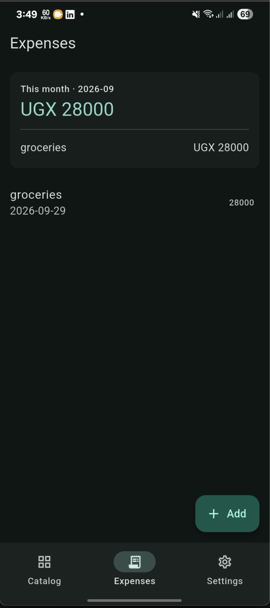
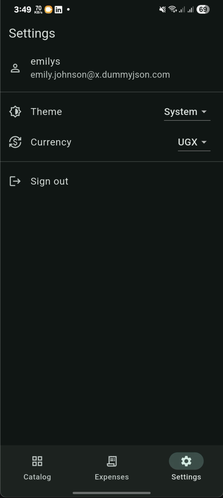

# Pocket Ledger

A personal expense tracker built on a deliberate, defensible architecture: four kinds of local storage, each chosen for one job; a layered codebase with a strict dependency rule; and a `Result`/`Failure` error model that keeps infrastructure concerns out of the UI.

The feature surface is intentionally small. The architectural discipline is not.

---

## Table of contents

- [Overview](#overview)
- [Screenshots](#screenshots)
- [Features](#features)
- [The storage contract](#the-storage-contract)
- [Tech stack](#tech-stack)
- [Architecture](#architecture)
  - [Layer responsibilities](#layer-responsibilities)
  - [Folder structure](#folder-structure)
  - [Dependency rule](#dependency-rule)
- [Error handling model](#error-handling-model)
- [Getting started](#getting-started)
- [Codegen workflow](#codegen-workflow)
- [Design decisions](#design-decisions)
  - [Why four storage layers](#why-four-storage-layers)
  - [Why per-user storage scoping](#why-per-user-storage-scoping)
  - [Why `keepAlive: true` on infrastructure](#why-keepalive-true-on-infrastructure)
  - [Why the router owns auth redirects](#why-the-router-owns-auth-redirects)
  - [Why `DateTime(year, month)` as a family key](#why-datetimeyear-month-as-a-family-key)
  - [Why silent refresh retries and interactive loads don't](#why-silent-refresh-retries-and-interactive-loads-dont)
- [Testing](#testing)
- [FAQ](#faq)
- [Known limitations](#known-limitations)
- [License](#license)

---

## Overview

Pocket Ledger lets a user sign in, browse a paginated product catalog, and record personal expenses against categories. It's a portfolio project — small enough to read in one sitting, rich enough to exercise the patterns that show up in production apps: mixed-network-and-local data, offset pagination with cache-merge, guarded routes, retry-with-backoff on background work, per-user storage isolation, and an error model that doesn't leak Dio exceptions into the widget tree.

**API:** [`dummyjson.com`](https://dummyjson.com/docs) — used for `/auth/login` and `/products`. Free, no key required.

**Demo credentials:** `emilys` / `emilyspass` — or `michaelw` / `michaelwpass` to see that user data is scoped per account.

---

## Screenshots

<table>
  <tr>
    <td align="center" width="50%">
      
      <br>
      <sub><b>Login</b> — token-based auth, session restored on cold start</sub>
    </td>
    <td align="center" width="50%">
      
      <br>
      <sub><b>Catalog</b> — paginated, served from Hive cache, refreshed in the background</sub>
    </td>
  </tr>
  <tr>
    <td align="center" width="50%">
      
      <br>
      <sub><b>Expenses</b> — monthly summary via one SQL aggregate, list from sqflite</sub>
    </td>
    <td align="center" width="50%">
      
      <br>
      <sub><b>Settings</b> — theme and currency, persisted with shared_preferences</sub>
    </td>
  </tr>
</table>

---

## Features

- **Authentication** — token-based login against a REST API. The session is written to encrypted storage on success and restored on cold start without ever flashing the login screen.
- **Catalog** — offset-paginated against the API (`limit`/`skip`), 20 items per page. Pages merge into a Hive cache keyed by product id, so offline the user sees the union of everything ever fetched. Cold start serves from cache instantly; a background refresh reloads page 0 with retry-with-backoff.
- **Expenses** — locally authored records with amount, category, date, and note. Full CRUD: create, list, edit, and swipe-to-delete.
- **Monthly summary** — total spend and per-category breakdown for the current month, computed with a single SQL aggregate query.
- **Settings** — theme mode and currency preference, persisted across restarts.
- **Per-user data isolation** — the catalog cache and expense database are both scoped by the signed-in user. Switching accounts swaps the visible dataset without a shared bag of state.
- **Offline-friendly** — the catalog and the expense list both work without a network connection once they've been loaded once.

---

## The storage contract

Four storage layers. No overlap. Each one exists because the others are wrong for its job.

| Layer | Package | Holds | Why this tool |
|---|---|---|---|
| **Secrets** | `flutter_secure_storage` | Auth token | Encrypted at rest via Keystore/Keychain. A credential never belongs in plain key-value. |
| **Settings** | `shared_preferences` | Theme, currency, onboarding flag | Trivial flags. A database would be overkill. |
| **Server cache** | `hive_ce` | Products fetched from the API | Fast key-value, perfect for "last known good copy of server data." Disposable if corrupt. |
| **User data** | `sqflite` | Expense entries | Genuinely relational. Needs `GROUP BY category` and `SUM(amount)` — operations key-value stores handle badly. |

**The rule, stated plainly:**

> Cached-from-server → Hive. User-authored-locally → SQL. Secrets → secure storage. Preferences → shared_preferences.

Every persisted value in the app has exactly one home. Nothing is duplicated across layers. Nothing is stored in the wrong tier "for convenience."

**Per-user scoping.** The Hive box uses one key per user (`products.<userId>`), and every row in the SQLite `expenses` table carries a `userId` column with a compound index on `(userId, date)`. Neither store mixes data across accounts.

---

## Tech stack

| Concern | Choice | Why |
|---|---|---|
| State | `flutter_riverpod` + `riverpod_annotation` | Compile-safe DI, testable without a widget tree, codegen for less boilerplate. |
| Networking | `dio` + `retrofit` | Typed HTTP client via codegen. Interceptors, cancel tokens, and timeout config out of the box. |
| Models | `freezed` + `json_serializable` | Immutable value types, structural equality, and JSON serialization with zero hand-written `fromJson`. |
| Routing | `go_router` | Declarative routes, deep linking, and a `redirect` hook that centralizes auth guarding. |
| Codegen | `build_runner` | Single runner for retrofit, freezed, json_serializable, and riverpod_generator. |
| Errors | `Result<T>` sealed class | No exceptions crossing layer boundaries. `Ok`/`Err` forces every caller to handle failure. |

---

## Architecture

### Layer responsibilities

```
┌──────────────────────────────────────────────────────────────────┐
│  presentation/                                                   │
│  Screens, widgets, and Riverpod controllers.                     │
│  Knows: domain entities, use cases.                              │
│  Does NOT know: Dio, Hive, sqflite, retrofit, or any data impl.  │
└──────────────────────────────────────────────────────────────────┘
                              │
                              ▼
┌──────────────────────────────────────────────────────────────────┐
│  domain/                                                         │
│  Entities, repository interfaces, use cases. Pure Dart.          │
│  Knows: nothing else.                                            │
│  Imports: only `core/error`.                                     │
└──────────────────────────────────────────────────────────────────┘
                              ▲
                              │
┌──────────────────────────────────────────────────────────────────┐
│  data/                                                           │
│  Remote data sources (retrofit), local stores, DTOs, mappers,    │
│  repository implementations.                                     │
│  Knows: domain contracts.                                        │
│  Depends on: Dio, Hive, sqflite, shared_preferences.             │
└──────────────────────────────────────────────────────────────────┘

        di/providers.dart — the composition root
        Only file that imports from both `data/` and `domain/`.
        Wires implementations to interfaces. Nothing else does.
```

### Folder structure

```
lib/
├── core/
│   ├── error/
│   │   ├── failure.dart              # domain-level error types
│   │   ├── result.dart               # Result<T> = Ok | Err
│   │   └── dio_failure_mapper.dart   # Dio -> Failure, one place
│   └── network/
│       └── retry.dart                # exponential backoff + jitter
│
├── domain/
│   ├── entities/                     # freezed value objects
│   │   ├── user_session.dart
│   │   ├── product.dart
│   │   ├── product_page.dart         # one paginated window + total
│   │   ├── expense_entry.dart        # + MonthlySummary, CategoryTotal
│   │   └── settings.dart
│   ├── repositories/                 # abstract interfaces
│   │   ├── auth_repository.dart
│   │   ├── catalog_repository.dart
│   │   ├── expense_repository.dart
│   │   └── settings_repository.dart
│   └── usecases/
│       ├── auth_usecases.dart
│       ├── catalog_usecases.dart
│       └── expense_usecases.dart     # + UpdateExpense
│
├── data/
│   ├── remote/
│   │   └── api/
│   │       ├── dtos.dart             # freezed DTOs
│   │       ├── api_client.dart       # retrofit client
│   │       └── dio_factory.dart      # Dio instance + interceptors
│   ├── local/
│   │   ├── secure/token_store.dart
│   │   ├── preferences/settings_store.dart
│   │   ├── cache/catalog_cache.dart  # per-user Hive key
│   │   └── database/
│   │       ├── app_database.dart     # schema v2 + migration
│   │       └── expense_dao.dart      # userId-scoped queries
│   └── repositories/
│       ├── auth_repository_impl.dart
│       ├── catalog_repository_impl.dart
│       ├── expense_repository_impl.dart
│       └── settings_repository_impl.dart
│
├── di/
│   └── providers.dart                # composition root
│
├── presentation/
│   ├── screens/
│   │   ├── splash_screen.dart
│   │   ├── login_screen.dart
│   │   ├── catalog_screen.dart
│   │   ├── expenses_screen.dart
│   │   ├── expense_form_screen.dart  # create + edit
│   │   └── settings_screen.dart
│   └── state/
│       └── catalog_state.dart        # paging UI state (freezed)
│
├── app/
│   ├── app.dart                      # MaterialApp.router
│   └── router.dart                   # GoRouter + redirect logic
└── main.dart                         # bootstrap + ProviderScope
```

### Dependency rule

| Layer | May import | May NOT import |
|---|---|---|
| `domain/` | `core/error`, `core/network` | Anything in `data/`, `presentation/`, `di/`, Flutter, Dio, or any storage package. |
| `data/` | `domain/`, `core/error`, `core/network` | `presentation/`, `di/`. |
| `presentation/` | `domain/`, `core/error`, `app/` | `data/`. |
| `di/` | Everything | Nothing enforces this, but it's the *only* file allowed to. |

If you ever find yourself wanting to `import '../data/...'` from a screen, the answer is a new use case in `domain/`, not an exception to the rule.

---

## Error handling model

Two sealed types do all the work.

**`Failure`** — a domain-level description of what went wrong. Every failure has a user-facing `message` and, where relevant, a `statusCode`.

```dart
sealed class Failure implements Exception {
  final String message;
  const Failure(this.message);
}

final class NetworkFailure extends Failure { ... }
final class TimeoutFailure extends Failure { ... }
final class ServerFailure extends Failure { ... }
final class AuthFailure extends Failure { ... }
final class StorageFailure extends Failure { ... }
final class ParsingFailure extends Failure { ... }
final class UnexpectedFailure extends Failure { ... }
```

**`Result<T>`** — a discriminated union. No repository method ever throws; they all return `Result<T>`.

```dart
sealed class Result<T> { const Result(); }
final class Ok<T> extends Result<T> { final T value; }
final class Err<T> extends Result<T> { final Failure failure; }
```

**The translation happens in exactly one place:** `mapDioException` in `core/error/dio_failure_mapper.dart`. Every repository catches `DioException`, passes it through the mapper, and returns `Err(failure)`. Nothing else in the codebase knows what a `DioException` is.

```dart
Future<Result<T>> _run<T>(Future<T> Function() body) async {
  try {
    return Ok(await body());
  } on DioException catch (e) {
    return Err(mapDioException(e));   // single point of translation
  } on Failure catch (e) {
    return Err(e);                    // domain failures pass through
  } catch (_) {
    return const Err(UnexpectedFailure());
  }
}
```

**Result of this discipline:** the widget layer never writes a `try/catch`. It folds the result:

```dart
result.fold(
  onOk: (value) => ...,
  onErr: (failure) => ...,
);
```

---

## Getting started

### Prerequisites

- Flutter `3.22+` (SDK constraint `>=3.4.0 <4.0.0`)
- Dart `3.4+`
- An emulator or physical device

### Install

```bash
git clone <your-repo-url> pocket_ledger
cd pocket_ledger
flutter pub get
```

### Generate code

This project uses `build_runner` for freezed, json_serializable, retrofit, and riverpod_generator. Generated files are not committed.

```bash
dart run build_runner build --delete-conflicting-outputs
```

For iterating during development, run the watcher in a second terminal:

```bash
dart run build_runner watch --delete-conflicting-outputs
```

### Run

```bash
flutter run
```

Sign in with the demo credentials shown on the login screen.

---

## Codegen workflow

Every file with a `part 'foo.g.dart'` directive needs a regeneration step after edits. The set is:

| Annotation | File type | Regenerated when |
|---|---|---|
| `@freezed` | `domain/entities/*.dart`, `presentation/state/*.dart`, `data/remote/api/dtos.dart` | Fields change |
| `@JsonSerializable` (via freezed) | Same files, when the model has a `fromJson` factory | Same |
| `@RestApi` | `data/remote/api/api_client.dart` | Endpoints change |
| `@riverpod` / `@Riverpod` | `di/providers.dart` | Provider signatures change — including a controller's state type |

**Rules of thumb:**

1. If the analyzer says "`_$FooFromJson` isn't defined", you forgot to run build_runner.
2. If it says "invalid override" and points at a method you just renamed, codegen is stale — rerun.
3. If it says "'CatalogState' can't be assigned to 'List<Product>'" after you changed a controller's `build()` return type, codegen is stale — rerun.
4. When in doubt, `dart run build_runner clean && dart run build_runner build --delete-conflicting-outputs`.

---

## Design decisions

### Why four storage layers

> **Secrets** go in `flutter_secure_storage` because a token is a credential and the OS provides a Keystore/Keychain for exactly that — plain key-value would put it in a world-readable file. **Preferences** go in `shared_preferences` because a theme flag is a boolean; wrapping it in SQL is overkill. **Server-sourced data** goes in Hive because it's a "last known good copy" — fast key-value reads, nothing relational to model, and the cache is disposable if it corrupts. **User-authored expenses** go in SQLite because they need range queries, `GROUP BY category`, and `SUM(amount)` for the monthly total — the exact operations key-value stores do badly.
>
> The rule is: cached-from-server → Hive, user-created-locally → SQL, secrets → secure storage, preferences → shared_preferences. Nothing overlaps, and every choice has a defensible why.

### Why per-user storage scoping

The app supports multiple accounts on the same device. If the catalog cache and expense database were global, signing in as user B after user A would show A's expenses under B's name — a visible, embarrassing bug in any live demo.

The fix is a single provider, `currentUserIdProvider`, that watches `authControllerProvider` and returns the signed-in user's id (or `null` when signed out). Two things hang off it:

- `catalogCache` uses `'products.<userId>'` as its Hive key. User A's cached catalog is invisible to user B, but stays on disk so A sees it again when they sign back in.
- `expenseDao` takes a `userId` constructor parameter and every query adds `WHERE userId = ?`. The `expenses` table has a compound index on `(userId, date)` so the scoping doesn't cost query performance.

Both list controllers (`CatalogController`, `ExpensesController`) `ref.watch(currentUserIdProvider)` in their `build()`, which means signing out and back in as a different user rebuilds them from scratch with the new user's data.

**The migration.** Schema version 2 adds the `userId` column. Existing rows get `userId = 0` — a "legacy user" bucket that no real session matches, so old data becomes invisible without being deleted. A clean install ships with v2 from the start.

### Why `keepAlive: true` on infrastructure

`riverpod_generator`'s default is **autoDispose**. That's the correct default for **UI-facing controllers** — the state should vanish when the screen does.

It's the wrong default for **anything holding an open resource**. Consider what happens with Dio:

1. Screen calls `ref.read(loginUseCaseProvider)`
2. Which reads `authRepositoryProvider`
3. Which reads `apiClientProvider`
4. Which reads `dioClientProvider`
5. All four get created transiently — nobody is *watching* them
6. `Login.call()` returns a `Future` and control yields
7. Riverpod's disposal pass runs
8. `dioClientProvider` auto-disposes → `dio.close()` fires
9. Your in-flight HTTP request wakes up → `Bad state: Can't establish connection after the adapter was closed.`

Every provider in `di/providers.dart` that isn't a controller is annotated `@Riverpod(keepAlive: true)`. The five `@riverpod class` controllers and the two `@riverpod` family functions are left autoDispose because the UI watches them.

**The telltale symptom:** any error containing `after the adapter was closed`, `Box has already been closed`, `database_closed`, or `Cannot add new events after calling close` means the same thing — a resource was disposed by a provider you `ref.read` but didn't `ref.watch`.

### Why the router owns auth redirects

Authentication is a **global** invariant, not a per-screen one. If `DashboardScreen` checked auth in `initState`, every new protected route would repeat the check, and a missed check would silently expose data.

Instead, `GoRouter.redirect` runs on every navigation. It reads `authControllerProvider` and returns a redirect target:

```dart
redirect: (context, state) {
  final auth = ref.read(authControllerProvider);
  final at = state.matchedLocation;

  if (auth.isLoading) {
    return at == Routes.splashPath ? null : Routes.splashPath;
  }

  final loggedIn = auth.value != null;

  if (!loggedIn) {
    return at == Routes.loginPath ? null : Routes.loginPath;
  }

  if (at == Routes.loginPath || at == Routes.splashPath) {
    return Routes.catalogPath;
  }
  return null;
},
```

The redirect is driven by `refreshListenable`, a `ChangeNotifier` that listens to `authControllerProvider` and fires on every state change. Add a new protected route tomorrow — it's guarded by construction. No screen needs to know auth exists.

**This also solves the "flash of login screen" problem.** `AuthController.build()` is async (it reads secure storage). While that future is pending, `auth.isLoading` is true, and the redirect parks everything on `/splash`. When the future resolves, the redirect re-evaluates and the user lands on `/dashboard` or `/login` — never having seen the wrong screen.

### Why `DateTime(year, month)` as a family key

Riverpod families key instances by the **equality** of their argument. `DateTime.now()` returns a value with microsecond precision — no two calls return `==`-equal objects.

The consequence, when `DateTime.now()` is used as a family key:

1. Screen builds → `now = 15:43:22.847823` → family instance A created → starts loading
2. Some state changes → screen rebuilds
3. `now = 15:43:22.851102` → different key → family instance B created → starts loading
4. Instance A's result lands, but nothing watches it — it's been disposed
5. Screen rebuilds again → instance C…

The provider is **permanently stuck at loading**, because the key changes every frame.

The fix is to normalize the key to a value that stays constant for as long as you want the cache to last:

```dart
final now = DateTime.now();
final monthKey = DateTime(now.year, now.month);   // first of the month
final summaryAsync = ref.watch(monthlySummaryProvider(monthKey));
```

`DateTime(2026, 9)` and `DateTime(2026, 9)` are `==`. One live instance per month. The summary resolves, caches, and only reloads when the month changes or when you explicitly invalidate it.

### Why silent refresh retries and interactive loads don't

`core/network/retry.dart` wraps an action in exponential backoff with jitter — three attempts, 500ms → 1s → 2s, ±25% jitter, capping at 8 seconds. It short-circuits on failures that will never succeed on retry: `AuthFailure`, `ParsingFailure`, `StorageFailure`, and any 4xx `ServerFailure`. Everything else (timeouts, 5xx, connection errors) gets retried.

**Only the silent background refresh uses it.** Here's the distinction:

- **Silent refresh** runs unprompted, behind the cache, while the user is already looking at content. The user has no feedback channel. If the network is flaky for two seconds, silently failing and stopping is a bad experience — they'd never see the new data. Retry buys a real improvement.
- **Interactive loads** are pull-to-refresh and the "Load more" tap. The user is watching a spinner. Retrying with backoff would extend the spinner for up to 3.5 seconds past the first failure. If they want to try again, they pull again. The right behavior is to fail fast and hand control back.

The `_isRetryable` function is the whole policy in one place. It's the kind of thing that usually gets scattered across every repository as ad-hoc flags; keeping it centralized means changing the policy is one file.

---

## Testing

**No tests ship with this repo.** The project was built as an exercise in architecture, not as a demonstration of test coverage.

What *is* true is that the architecture is designed so that every layer except `presentation/` is testable without a Flutter widget tree. That's the point of separating `domain/` from `data/` and `presentation/` — the interesting logic doesn't need UI to run.

If tests were added, they'd split into these categories:

**Domain use cases** — pure functions over repository interfaces. Construct the use case with a fake repository, assert on the returned `Result`.

```dart
test('rejects an expense with a non-positive amount', () async {
  final useCase = AddExpense(FakeExpenseRepository());
  final result = await useCase(ExpenseEntry(
    amount: 0,
    category: 'food',
    date: DateTime.now(),
  ));
  expect(result, isA<Err<int>>());
});
```

**Repositories** — inject a fake data source that returns a canned DTO or throws a `Failure`. Assert the returned `Result` shape. The `mapDioException` function is a pure function; feed it `DioException` instances with various `type` values and assert the `Failure` subtype.

**Retry logic** — `withRetry` accepts an injectable `Random` for deterministic jitter. Test that it retries on `NetworkFailure`, that it short-circuits on `AuthFailure`, and that it exhausts `maxAttempts` on persistent `ServerFailure`.

**Controllers** — override the relevant use case provider in a `ProviderContainer`, drive the controller, assert on its state transitions. For `CatalogController`, that means asserting on the accumulated `CatalogState` after `loadMore()` runs: items grow, `hasMore` flips to `false` at the last page.

**Screens** — override the controller provider with a fake. Pump the screen. Assert on what renders.

No test would ever touch the network, secure storage, Hive, or sqflite — the DI graph lets you swap each one for a fake without changing a single line of the code under test.

---

## FAQ

**Why a monorepo-style `lib/` instead of feature-first?**

At this size, layer-first keeps the dependency rule visible. Every repository lives next to every other repository. Every entity lives next to every other entity. If the project grew past ~4 features, feature-first would become the better split — and the internal structure of each layer would move over unchanged.

**Why `freezed` when the models have 4–5 fields?**

The alternative is hand-written `fromJson`, `==`, `hashCode`, and `copyWith` on every model. Freezed gives all four, plus exhaustive pattern matching, in one annotation. The codegen cost is one `build_runner` run. The rule is: every value object in this codebase is freezed, including `ProductPage` and `CatalogState`, even when they carry no JSON — consistency is worth more than saving fifteen lines.

**Why does the catalog repository expose three separate methods — `fetchPage`, `readFromCache`, `mergeIntoCache`?**

Because the decisions that matter are **presentation** decisions, and the repository shouldn't be making them. *When* to serve cache, *when* to fetch, *which page to request*, *whether to replace or merge* — all belong to the controller. The repository exposes the three primitives; the controller sequences them. If the product later decides "always show fresh data, cache is fallback only," the change is in the controller, not in three layers of plumbing.

**What's the deal with `ref.invalidate(monthlySummaryProvider)`?**

`monthlySummaryProvider` is a family (keyed by month). Calling `ref.invalidate` with the family itself — no arguments — invalidates **every** instance of that family. After an expense is added, edited, or deleted, we want every month's summary to be refreshed. One call. All instances.

The alternative — `ref.watch(expensesControllerProvider)` inside the summary — was tried and removed. It caused the summary to re-run its SQL query on every state transition of the expenses list, including the initial `loading → data`, which kept the summary permanently one step behind. Explicit invalidation after mutation is both more correct and more efficient.

**How is the catalog paginated, and why cache-merge instead of replacing?**

dummyjson's `/products` supports offset pagination — `?limit=N&skip=M` — and returns `{ products, total, skip, limit }`. The repository fetches one window at a time and merges it into the Hive cache by product id, deduplicated and sorted. This means:

1. **The cache only grows.** Page 1 doesn't overwrite page 0; it adds to it. Offline, the user sees the union of every page ever loaded.
2. **Refresh is not a wipe.** A pull-to-refresh fetches page 0 and replaces the visible list, but the underlying cache retains every other page — so scrolling down again serves pages 1..N instantly from disk before any network call.
3. **Duplicate products are impossible.** The merge uses a `Map<int, Product>` keyed by id. A product that appears on two pages (which shouldn't happen with dummyjson, but could with a real API) resolves to whichever version arrived last.

The controller's `CatalogState` is a freezed value object holding `items`, `total`, `hasMore`, and `isLoadingMore`. `hasMore` is computed as `items.length < total` — the invariant the screen actually cares about.

**Why does the login screen not navigate on success?**

Because the router's redirect handles it. The screen calls `authControllerProvider.notifier.login(...)`, which sets `state = AsyncData(session)`. The `refreshListenable` fires, the redirect re-evaluates, and the user lands on the dashboard. The screen has no navigation code, which means it has no navigation bugs.

**Why does the form screen serve both create and edit?**

`ExpenseFormScreen` takes an optional `ExpenseEntry? initial`. If null, it's a create form. If present, fields pre-fill and the save button routes to `edit` instead of `add`. Same layout, same validators, one screen. Adding a second screen for editing would mean maintaining the same validation twice — a classic source of drift bugs, where one screen gets a fix and the other doesn't.

---

## Known limitations

### API constraints

- **Offset pagination, not cursor pagination.** dummyjson's `/products` exposes `?limit=` and `?skip=` and returns a `total`. It does not offer cursors. Cursor pagination is a client-server contract; the client can't invent it. On a real feed with inserts between page fetches, offset pagination can skip or duplicate items at page boundaries. The fix is a server change, not a client one.

### Not attempted

- **Internationalization.** All UI strings are hardcoded English. The currency picker changes a label, not the locale. Wiring `flutter_localizations` + `intl` + `.arb` files is a project-level decision about which locales to support; doing it half-heartedly would be worse than not doing it.

### Test coverage

- **No automated tests.** The architecture is deliberately testable (pure use cases, injectable repositories, override-able providers) but no test suite ships with the repo. Adding one is a few hours of work, most of it mechanical.

---

## License

MIT. See `LICENSE` for the full text.